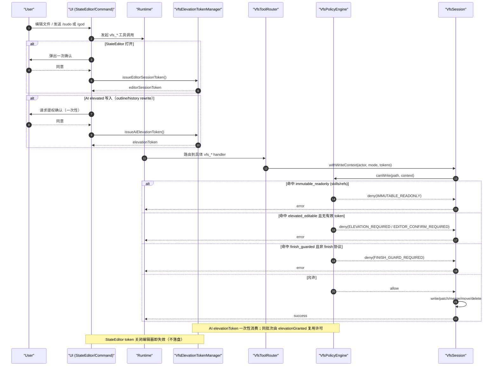

# VFS v2 架构设计文档（彻底重构版）

## 1. 目标与边界

本次 VFS v2 为破坏性重构（无向后兼容层），目标是把文件系统抽象提升为单一内核，并让权限、路径、资源、工具能力完全中心化。

### 核心目标
- 以 VFS 作为**唯一状态事实来源**（state = files）。
- 把“可访问什么、可写什么、谁可以写”从散落代码迁移到注册中心。
- 支持 fork/shared 双语义并严格隔离。
- 引入受控提权：`/god`、`/sudo` 是提权入口，不是常驻超级权限。
- 工具文案、系统 prompt、工具 schema 描述与真实权限保持一致。

### 明确约束
- `skills/**`、`refs/**` 永久只读（任何 actor/mode 都不可写）。
- AI 默认可写普通资源（`default_editable`）。
- StateEditor 默认可编辑，但必须每次打开确认（内存 token）。
- 受保护路径（`elevated_editable`）需要一次性用户确认提权 token。
- 会话收口路径（`finish_guarded`）只能经 finish 协议写入。

---

## 2. 模块总览（OO）

VFS v2 的核心对象在 `src/services/vfs/core/`：

- `VfsPathRegistry`（`pathRegistry.ts`）
  - 统一路径模板匹配（glob）
  - 输出路径分类：权限类 + scope + ruleId

- `VfsResourceRegistry`（`resourceRegistry.ts`）
  - 统一资源类型注册（资源描述、路径模板、内容类型）
  - 输出资源匹配结果（resourceType + permissionClass + scope）

- `VfsPolicyEngine`（`policyEngine.ts`）
  - 统一读写判定：`canRead/canWrite(actor, mode, path, token)`
  - 只在此处定义权限规则，不在工具分散硬编码

- `VfsElevationTokenManager`（`elevation.ts`）
  - 管理 AI 提权 token（一次性消费）
  - 管理 StateEditor session token（每次打开确认）

- `VfsToolCapabilityRegistry`（`toolCapabilityRegistry.ts`）
  - 工具能力声明（读写类、是否需提权、immutable zones、toolset）
  - 用于 prompt/tool 文案自动生成

- `VfsToolRouter`（`toolRouter.ts`）
  - 工具注册入口
  - 注册时校验工具是否存在 capability 声明

- `ConversationHistoryRewriteService`（`conversationHistoryRewriteService.ts`）
  - 提权后历史对话改写
  - 维护 conversation index 一致性
  - 记录 rewrite event 到受控路径

---

## 3. 权限模型

### 3.1 权限类

- `immutable_readonly`
  - 永久只读
  - 典型路径：`skills/**`、`refs/**`

- `default_editable`
  - AI 默认可写
  - StateEditor 需会话确认 token 后可写

- `elevated_editable`
  - 受保护路径
  - AI 需 `/god` 或 `/sudo` + 用户确认的一次性 token
  - StateEditor 需 editor session token（每次打开确认）

- `finish_guarded`
  - 会话收口路径
  - 仅 finish 协议可写（如 `vfs_commit_turn`、`vfs_finish_summary`）

### 3.2 actor / mode

- actor：`ai` / `user_editor` / `system`
- mode：`normal` / `god` / `sudo`

### 3.3 关键判定规则

- `immutable_readonly`：一律拒绝写入。
- `default_editable`：
  - `ai`：允许（normal/god/sudo）。
  - `user_editor`：必须有有效 editor session token。
- `elevated_editable`：
  - `ai`：必须 mode 为 `god/sudo` 且 token 有效（一次性消费）。
  - `user_editor`：必须有有效 editor session token。
- `finish_guarded`：必须 `allowFinishGuardedWrite=true`（由 finish 工具上下文授予）。

---

## 4. 路径与作用域模型（shared / fork）

### 4.1 中央路径分类

`VfsPathRegistry` 统一声明规则并按顺序匹配，核心路径策略：

- Immutable：
  - `skills`
  - `skills/**`
  - `refs`
  - `refs/**`

- Elevated：
  - `outline/outline.json`
  - `outline/phases/**`
  - `conversation/history_rewrites/**`

- Finish Guarded：
  - `conversation`
  - `conversation/**`
  - `summary/state.json`

- Shared editable：
  - `custom_rules/**`（含 legacy 映射）
  - `world/theme_config.json`
  - `world/runtime/custom_rules_ack_state.json`

- Fallback：`**` -> `default_editable + fork`

### 4.2 shared/fork 语义

- `shared`：跨 fork 共享，写入对所有 fork 可见。
- `fork`：仅当前 fork 生效。
- 快照恢复时过滤 immutable 路径，防止只读区被覆盖回写。

---

## 5. 提权与确认机制（不落盘）

### 5.1 AI 提权（/god, /sudo）

- 由用户确认后签发一次性 AI elevation token。
- token 仅当前请求/批次有效。
- 写 `elevated_editable` 时由 `PolicyEngine` 消费 token。
- 若同批次有多次 elevated 写，`elevationGranted` 作为请求内 latch 复用许可。

### 5.3 关键写入时序图

---

## 6. 工具能力与 Prompt/Schema 一致性

### 6.1 工具能力注册中心

每个 `vfs_*` 工具在 `VfsToolCapabilityRegistry` 声明：
- `readOnly`
- `mayWriteClasses`
- `needsElevationFor`
- `immutableZones`
- `toolsets`
- `isFinishTool`

### 6.2 Prompt 自动对齐

`formatVfsToolCapabilitiesForPrompt()` 直接从 registry 渲染能力契约，系统 prompt 不再手写权限真相。

### 6.3 Tool Schema 描述自动注入

`defineTool()` 在 `src/services/tools.ts` 内自动附加权限契约文本：
- 工具描述（schema）与注册中心统一。
- 避免“工具参数说明”和“实际可写能力”漂移。

---

## 7. Finish 协议

- `finish_guarded` 路径不可由通用写工具直写。
- `vfs_commit_turn` / `vfs_finish_summary` 在专用上下文中开启 `allowFinishGuardedWrite`。
- `vfs_tx` 仅当包含 `commit_turn` 且作为最后一步时，允许收口写入。

---

## 8. 历史对话修订（受控）

`ConversationHistoryRewriteService` 提供：
- `rewriteTurn()`：改写指定 turn
- `rewriteIndex()`：改写并归一化 conversation index
- `recordRewriteEvent()`：写入 `conversation/history_rewrites/**`

所有写入都走 `VfsSession + PolicyEngine`，避免旁路。

---

## 9. AI 操作规约（执行层）

给 AI 的统一执行顺序建议：

1. 先读后写：`vfs_ls` / `vfs_schema` / `vfs_read` / `vfs_search`。
2. 普通资源：直接写 `default_editable`。
3. 受保护资源：若命中 `elevated_editable`，必须请求 `/god` 或 `/sudo` 的用户确认 token。
4. 永久只读：不得尝试写 `skills/**`、`refs/**`。
5. 收口路径：仅使用 finish 工具写 `conversation/**`、`summary/state.json`。
6. 批量变更优先 `vfs_tx`，确保原子提交与一致性。

---

## 10. 测试策略与验收

新增与更新测试覆盖：
- 权限矩阵（actor × mode × class）
- elevation token 生命周期（一次性、批次内 latch）
- StateEditor 会话确认
- finish_guarded 拦截与 finish 协议放行
- immutable 区拒绝写入
- fork/shared 分区行为
- prompt / schema 与 capability registry 一致性

关键测试文件（新增/重点）：
- `src/services/vfs/core/__tests__/policyEngine.test.ts`
- `src/services/vfs/core/__tests__/elevation.test.ts`
- `src/services/vfs/core/__tests__/conversationHistoryRewriteService.test.ts`
- `src/services/vfsToolsets.test.ts`
- `src/services/tools/__tests__/vfsTools.test.ts`
- `src/services/prompts/atoms/core/__tests__/promptHygiene.test.ts`

---

## 11. 扩展指南

新增资源类别时：
1. 在 `VfsPathRegistry` 添加路径规则（permissionClass + scope）。
2. 在 `VfsResourceRegistry` 添加资源描述（resourceType + patterns + contentTypes）。
3. 在 `VfsToolCapabilityRegistry` 更新相关工具能力。
4. 通过 `VfsToolRouter` 注册对应 handler。
5. 补充 policy/prompt/schema 一致性测试。

新增提权场景时：
- 优先新增路径规则与能力声明，不要在 handler 内写特判。
- token 生命周期必须保持内存态、短周期、可撤销。

---

## 12. 非目标（当前版本）

- 不提供向后兼容迁移层。
- 不引入持久化授权状态（避免越权残留）。
- 不允许跳过 VFS 直接写会话核心文件。

