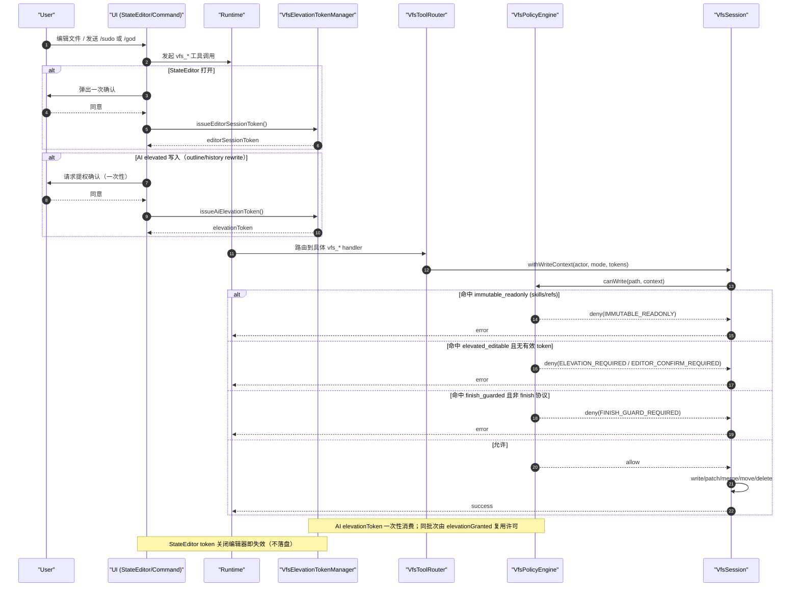
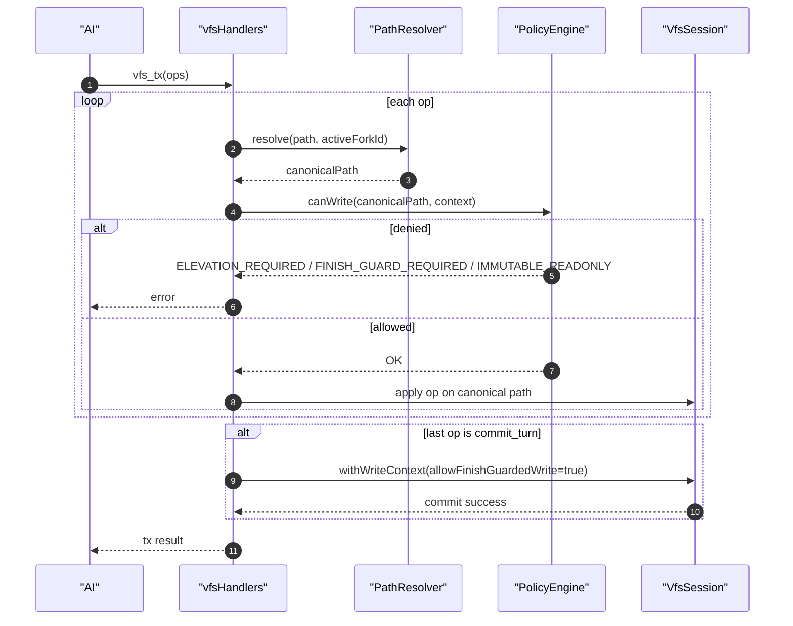
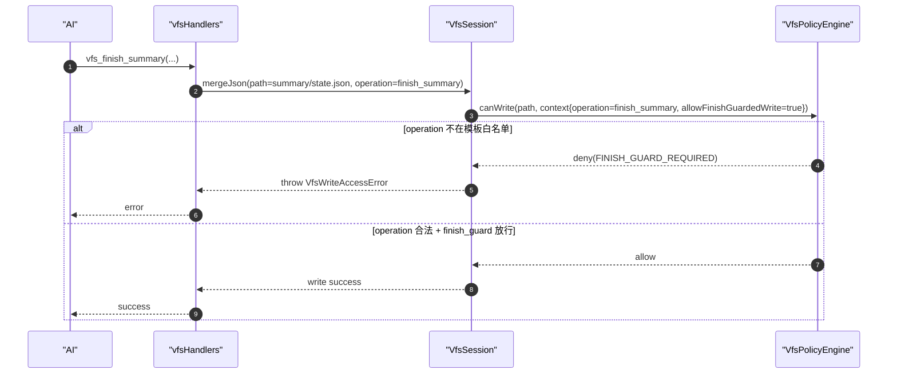
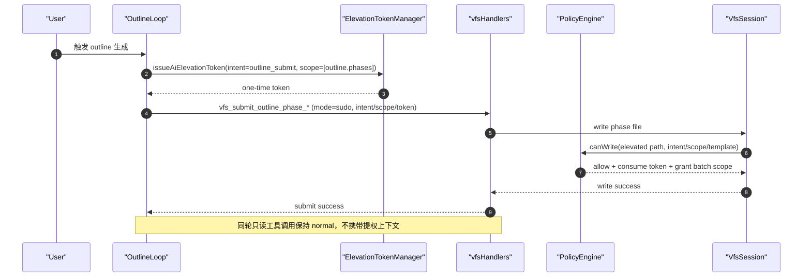
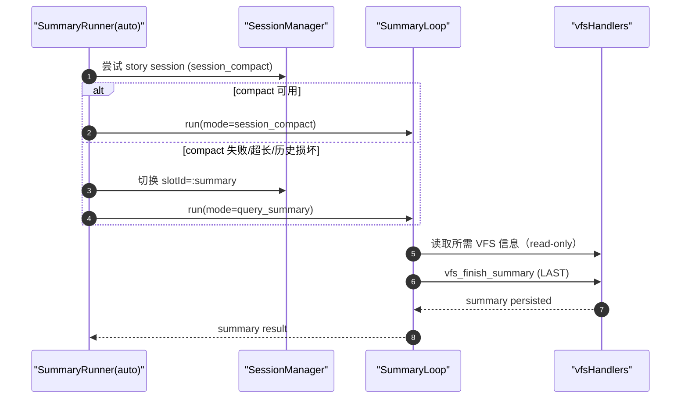
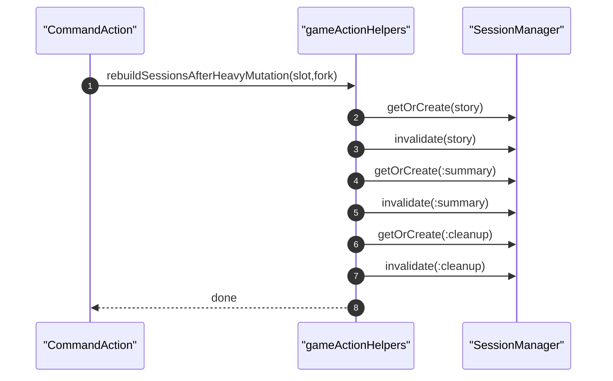

# VFS v2 架构设计文档（彻底重构版）

## 1. 目标与边界

本次 VFS v2 为破坏性重构（无向后兼容层），目标是把文件系统抽象提升为单一内核，并让权限、路径、资源、工具能力完全中心化。

### 核心目标

- 以 VFS 作为**唯一状态事实来源**（state = files）。
- 把“可访问什么、可写什么、谁可以写”从散落代码迁移到注册中心。
- 支持 fork/shared 双语义并严格隔离。
- 引入受控提权：`/god`、`/sudo` 是提权入口，不是常驻超级权限。
- 工具文案、系统 prompt、工具 schema 描述与真实权限保持一致。

### 明确约束

- `skills/**`、`refs/**` 永久只读（任何 actor/mode 都不可写）。
- AI 默认可写普通资源（`default_editable`）。
- StateEditor 默认可编辑，但必须每次打开确认（内存 token）。
- 受保护路径（`elevated_editable`）需要一次性用户确认提权 token。
- 会话收口路径（`finish_guarded`）只能经 finish 协议写入。

---

## 2. 模块总览（OO）

VFS v2 的核心对象在 `src/services/vfs/core/`：

- `VfsPathRegistry`（`pathRegistry.ts`）
  - 统一路径模板匹配（glob）
  - 输出路径分类：权限类 + scope + ruleId

- `VfsResourceRegistry`（`resourceRegistry.ts`）
  - 统一资源类型注册（资源描述、路径模板、内容类型）
  - 输出资源匹配结果（resourceType + permissionClass + scope）

- `VfsPolicyEngine`（`policyEngine.ts`）
  - 统一读写判定：`canRead/canWrite(actor, mode, path, token)`
  - 只在此处定义权限规则，不在工具分散硬编码

- `VfsElevationTokenManager`（`elevation.ts`）
  - 管理 AI 提权 token（一次性消费）
  - 管理 StateEditor session token（每次打开确认）

- `VfsToolCapabilityRegistry`（`toolCapabilityRegistry.ts`）
  - 工具能力声明（读写类、是否需提权、immutable zones、toolset）
  - 用于 prompt/tool 文案自动生成

- `VfsToolRouter`（`toolRouter.ts`）
  - 工具注册入口
  - 注册时校验工具是否存在 capability 声明

- `ConversationHistoryRewriteService`（`conversationHistoryRewriteService.ts`）
  - 提权后历史对话改写
  - 维护 conversation index 一致性
  - 记录 rewrite event 到受控路径

---

## 3. 权限模型

### 3.1 权限类

- `immutable_readonly`
  - 永久只读
  - 典型路径：`skills/**`、`refs/**`

- `default_editable`
  - AI 默认可写
  - StateEditor 需会话确认 token 后可写

- `elevated_editable`
  - 受保护路径
  - AI 需 `/god` 或 `/sudo` + 用户确认的一次性 token
  - StateEditor 需 editor session token（每次打开确认）

- `finish_guarded`
  - 会话收口路径
  - 仅 finish 协议可写（如 `vfs_commit_turn`、`vfs_finish_summary`）

### 3.2 actor / mode

- actor：`ai` / `user_editor` / `system`
- mode：`normal` / `god` / `sudo`

### 3.3 关键判定规则

- `immutable_readonly`：一律拒绝写入。
- `default_editable`：
  - `ai`：允许（normal/god/sudo）。
  - `user_editor`：必须有有效 editor session token。
- `elevated_editable`：
  - `ai`：必须 mode 为 `god/sudo` 且 token 有效（一次性消费）。
  - `user_editor`：必须有有效 editor session token。
- `finish_guarded`：必须 `allowFinishGuardedWrite=true`（由 finish 工具上下文授予）。

---

## 4. 路径与作用域模型（shared / fork）

### 4.1 中央路径分类

`VfsPathRegistry` 统一声明规则并按顺序匹配，核心路径策略：

- Immutable：
  - `skills`
  - `skills/**`
  - `refs`
  - `refs/**`

- Elevated：
  - `outline/outline.json`
  - `outline/phases/**`
  - `conversation/history_rewrites/**`

- Finish Guarded：
  - `conversation`
  - `conversation/**`
  - `summary/state.json`

- Shared editable：
  - `custom_rules/**`（含 legacy 映射）
  - `world/theme_config.json`
  - `world/runtime/custom_rules_ack_state.json`

- Fallback：`**` -> `default_editable + fork`

### 4.2 shared/fork 语义

- `shared`：跨 fork 共享，写入对所有 fork 可见。
- `fork`：仅当前 fork 生效。
- 快照恢复时过滤 immutable 路径，防止只读区被覆盖回写。

---

## 5. 提权与确认机制（不落盘）

### 5.1 AI 提权（/god, /sudo）

- 由用户确认后签发一次性 AI elevation token。
- token 仅当前请求/批次有效。
- 写 `elevated_editable` 时由 `PolicyEngine` 消费 token。
- 若同批次有多次 elevated 写，`elevationGranted` 作为请求内 latch 复用许可。

### 5.3 关键写入时序图

---

## 6. 工具能力与 Prompt/Schema 一致性

### 6.1 工具能力注册中心

每个 `vfs_*` 工具在 `VfsToolCapabilityRegistry` 声明：

- `readOnly`
- `mayWriteClasses`
- `needsElevationFor`
- `immutableZones`
- `toolsets`
- `isFinishTool`

### 6.2 Prompt 自动对齐

`formatVfsToolCapabilitiesForPrompt()` 直接从 registry 渲染能力契约，系统 prompt 不再手写权限真相。

### 6.3 Tool Schema 描述自动注入

`defineTool()` 在 `src/services/tools.ts` 内自动附加权限契约文本：

- 工具描述（schema）与注册中心统一。
- 避免“工具参数说明”和“实际可写能力”漂移。

---

## 7. Finish 协议

- `finish_guarded` 路径不可由通用写工具直写。
- `vfs_commit_turn` / `vfs_finish_summary` 在专用上下文中开启 `allowFinishGuardedWrite`。
- `vfs_tx` 仅当包含 `commit_turn` 且作为最后一步时，允许收口写入。

---

## 8. 历史对话修订（受控）

`ConversationHistoryRewriteService` 提供：

- `rewriteTurn()`：改写指定 turn
- `rewriteIndex()`：改写并归一化 conversation index
- `recordRewriteEvent()`：写入 `conversation/history_rewrites/**`

所有写入都走 `VfsSession + PolicyEngine`，避免旁路。

---

## 9. AI 操作规约（执行层）

给 AI 的统一执行顺序建议：

1. 先读后写：`vfs_ls` / `vfs_schema` / `vfs_read` / `vfs_search`。
2. 普通资源：直接写 `default_editable`。
3. 受保护资源：若命中 `elevated_editable`，必须请求 `/god` 或 `/sudo` 的用户确认 token。
4. 永久只读：不得尝试写 `skills/**`、`refs/**`。
5. 收口路径：仅使用 finish 工具写 `conversation/**`、`summary/state.json`。
6. 批量变更优先 `vfs_tx`，确保原子提交与一致性。

---

## 10. 测试策略与验收

新增与更新测试覆盖：

- 权限矩阵（actor × mode × class）
- elevation token 生命周期（一次性、批次内 latch）
- StateEditor 会话确认
- finish_guarded 拦截与 finish 协议放行
- immutable 区拒绝写入
- fork/shared 分区行为
- prompt / schema 与 capability registry 一致性

关键测试文件（新增/重点）：

- `src/services/vfs/core/__tests__/policyEngine.test.ts`
- `src/services/vfs/core/__tests__/elevation.test.ts`
- `src/services/vfs/core/__tests__/conversationHistoryRewriteService.test.ts`
- `src/services/vfsToolsets.test.ts`
- `src/services/tools/__tests__/vfsTools.test.ts`
- `src/services/prompts/atoms/core/__tests__/promptHygiene.test.ts`

---

## 11. 扩展指南

新增资源类别时：

1. 在 `VfsPathRegistry` 添加路径规则（permissionClass + scope）。
2. 在 `VfsResourceRegistry` 添加资源描述（resourceType + patterns + contentTypes）。
3. 在 `VfsToolCapabilityRegistry` 更新相关工具能力。
4. 通过 `VfsToolRouter` 注册对应 handler。
5. 补充 policy/prompt/schema 一致性测试。

新增提权场景时：

- 优先新增路径规则与能力声明，不要在 handler 内写特判。
- token 生命周期必须保持内存态、短周期、可撤销。

---

## 12. 非目标（当前版本）

- 不提供向后兼容迁移层。
- 不引入持久化授权状态（避免越权残留）。
- 不允许跳过 VFS 直接写会话核心文件。

---

## 13. VFS v2.1 实施结果（资源分层 + 挂载内核）

### 13.1 新增核心组件

- `src/services/vfs/core/mountRegistry.ts`
  - 定义 canonical 与 `current/*` alias 挂载。
- `src/services/vfs/core/pathResolver.ts`
  - 统一路径解析：输入可为 `current/*`、legacy 相对路径、canonical。
  - 输出 `canonicalPath + logicalPath + displayPath + mountKind`。
- `src/services/vfs/core/resourceTemplateRegistry.ts`
  - 用资源模板（domain/shape/scope/permissionClass/patterns）驱动分类。

### 13.2 Canonical 路径映射（已落地）

- `skills/**` -> `shared/system/skills/**`
- `refs/**` -> `shared/system/refs/**`
- `custom_rules/**` -> `shared/config/custom_rules/**`
- `world/theme_config.json` -> `shared/config/theme/theme_config.json`
- `outline/**` -> `shared/narrative/outline/**`
- `world/**` -> `forks/{forkId}/story/world/**`
- `conversation/**` -> `forks/{forkId}/story/conversation/**`
- `summary/state.json` -> `forks/{forkId}/story/summary/state.json`
- `conversation/history_rewrites/**` -> `forks/{forkId}/ops/history_rewrites/**`

> 对外仍支持 `current/*` 与 legacy 路径输入，内部统一解析为 canonical。

### 13.3 策略与会话层改造

- `VfsPathRegistry` 改为模板驱动分类（模板二次分类器）。
- `VfsResourceRegistry` 改为模板匹配入口。
- `VfsPolicyEngine` 基于解析后的 canonical 分类判定权限。
- `VfsSession`：
  - 内部存储 canonical key；
  - `snapshot()` / `snapshotAll()` 输出逻辑视图路径（兼容调用方）；
  - `snapshotCanonical()` / `snapshotAllCanonical()` 可用于内核调试；
  - `restore()` 接受 legacy/canonical 输入并统一写入 canonical。

### 13.4 提权与 finish 协议状态

- AI elevated 写仍需 `/god` 或 `/sudo` + 一次性 token。
- StateEditor 每次打开确认 token，关闭即失效。
- `finish_guarded` 仅 finish 协议可写。
- rewrite 事件写入 canonical 路径：`forks/{id}/ops/history_rewrites/**`。

### 13.5 v2.1 事务/收口时序图

### 13.6 v2.1 新增测试

- `src/services/vfs/core/__tests__/pathResolver.test.ts`
- `src/services/vfs/core/__tests__/resourceTemplateRegistry.test.ts`
- `src/services/vfs/core/__tests__/pathRegistry.test.ts`
- 更新：`currentAlias`、`conversationHistoryRewriteService`、`vfsConversation` 等测试以适配新路径语义。

## 14. VFS v2.2 补充：资源分层细化 + 操作级策略

### 14.1 新增模板维度（已落地）

每个 `VfsResourceTemplate` 现包含：

- `criticality`: `core | secondary | ephemeral`
- `retention`: `session | save | archival`
- `allowedWriteOps`: 写操作白名单（示例：`write` / `json_patch` / `json_merge` / `move` / `delete` / `finish_commit` / `finish_summary` / `history_rewrite`）

这使资源从“仅路径匹配”升级为“路径 + 生命周期 + 关键级别 + 操作能力”四维模型。

### 14.2 操作级权限判定（已落地）

`VfsPolicyEngine.canWrite()` 现在先判断操作是否在模板白名单中，再执行权限类判定：

1. `immutable_readonly` 永拒绝
2. `operation ∈ allowedWriteOps` 才可继续
3. `finish_guarded` 仍要求 `allowFinishGuardedWrite=true`
4. `elevated_editable` 仍要求 `/god|/sudo + one-time token`

> 说明：错误码保持不扩展，操作不允许时复用 `FINISH_GUARD_REQUIRED`。

### 14.3 关键模板策略示例（已落地）

- `shared/system/skills/**` / `shared/system/refs/**`
  - `criticality=core`, `retention=archival`, `allowedWriteOps=[]`
- `forks/*/story/conversation/**`
  - `permissionClass=finish_guarded`
  - `allowedWriteOps=[finish_commit, history_rewrite]`
- `forks/*/story/summary/state.json`
  - `permissionClass=finish_guarded`
  - `allowedWriteOps=[finish_summary]`
- `forks/*/ops/history_rewrites/**`
  - `permissionClass=elevated_editable`
  - `retention=archival`
  - `allowedWriteOps` 包含 `history_rewrite`

### 14.4 收口/修订写入通道（已落地）

- `vfs_commit_turn` 与 `vfs_tx` 内 `commit_turn` 分支
  - 对 conversation/index/turn 写入显式标记 `operation=finish_commit`
- `vfs_finish_summary`
  - 对 summary 写入显式标记 `operation=finish_summary`
- `ConversationHistoryRewriteService`
  - 改写 turn/index 与 rewrite event 均标记 `operation=history_rewrite`

### 14.5 v2.2 操作白名单时序图

### 14.6 v2.2 验证状态

- 新增/更新测试已覆盖：
  - `policyEngine` 操作白名单断言
  - `resourceTemplateRegistry` 新维度断言
  - `resourceRegistry/pathRegistry` 元数据投影断言
- 全量验证：
  - `pnpm -s vitest run` ✅
  - `pnpm -s tsc --noEmit` ✅

### 14.7 Tool Introspection Alignment (v2.2)

- `vfs_schema` now returns `classification` metadata per path:
  - `templateId`, `permissionClass`, `scope`, `domain`, `resourceShape`, `criticality`, `retention`, `allowedWriteOps`.
- `vfs_stat` now returns the same `classification` metadata for both file and directory stats.
- Tool contracts injected by `defineTool()` now include operation hints (when static) and explicitly state that template-level operation contracts are enforced at runtime.

This keeps tooling output, prompt instructions, and policy runtime in lock-step.

## 15. Prompt 文案统一基线（v2.2 收口）

为避免“提示词写法”与“运行时策略”漂移，后续所有 prompt/tool 文案必须遵循以下统一口径：

1. **路径口径统一**
   - 必须同时声明 canonical 与 alias：
     - canonical：`shared/**`、`forks/{forkId}/**`
     - alias：`current/**`
   - 业务示例可使用 `current/**`，但必须说明其会解析到 canonical。

2. **权限口径统一**
   - 固定四类：`immutable_readonly` / `default_editable` / `elevated_editable` / `finish_guarded`
   - `immutable_readonly` 永远包含：`shared/system/skills/**`、`shared/system/refs/**`（含 alias 视图）。
   - `elevated_editable` 必须明确：`/god` 或 `/sudo` + 一次性确认 token。

3. **finish 与操作白名单口径统一**
   - conversation 收口：`finish_commit`
   - summary 收口：`finish_summary`
   - history rewrite：`history_rewrite`
   - prompt 必须禁止通用写工具直写 finish_guarded 路径。

4. **工具说明来源统一**
   - 工具能力说明以 `VfsToolCapabilityRegistry` 为唯一来源。
   - schema 文案通过 `defineTool()` 自动注入权限契约，不手写分叉版本。

5. **回归检查统一**
   - 变更 prompt/tool 文案后，至少运行：
     - `pnpm -s vitest run src/services/prompts/atoms/core/__tests__/promptHygiene.test.ts`
     - `pnpm -s vitest run src/services/prompts/atoms/core/__tests__/systemMessages.test.ts`
     - `pnpm -s vitest run src/services/tools/__tests__/vfsTools.test.ts`

## 16. Prompt 全域收口（v2.2+）

本轮在已有 `toolUsage/systemMessages/runtimeFloor/outputFormat` 基础上，继续完成全域口径统一：

- `stateManagement`：补充 canonical/alias 路径模型、finish-guarded 禁写说明、outline canonical 写入路径。
- `memoryPolicy`：补充 canonical/alias 路径模型、summary/world bootstrap canonical 路径、conversation 搜索 canonical + alias。
- `gmKnowledge`：补充 canonical/alias 说明，统一 unlock 写入示例到 canonical + alias 对照。
- `entityContext`：统一实体编辑路径说明为 canonical 主路径 + alias 视图。
- `protocols`：`[SUDO]` 明确为受控提权入口（immutable/finish 保护仍生效），不再描述为硬绕过。

对应回归测试已增强并通过：

- `src/services/prompts/atoms/core/__tests__/promptHygiene.test.ts`
- `src/services/prompts/atoms/core/__tests__/stateManagement.test.ts`
- `src/services/prompts/atoms/core/__tests__/systemMessages.test.ts`
- `src/services/prompts/skills/__tests__/builder.test.ts`

## 17. VFS v2.2.3 一次性修复收口（提权闭环 + 双 Summary + 流程隔离）

### 17.1 提权闭环（intent + scope + 一次性 token）

核心改动：

- `src/services/vfs/core/types.ts`
  - 新增 `VfsElevationIntent`：
    - `outline_submit | sudo_command | god_turn | history_rewrite | editor_session`
  - `VfsWriteContext` 增加：
    - `elevationIntent`
    - `elevationScopeTemplateIds`
    - `elevationGrantedIntent`
    - `elevationGrantedScopeTemplateIds`
- `src/services/vfs/core/elevation.ts`
  - `issueAiElevationToken({ intent, scopeTemplateIds, consumeOnUse? })`
  - `consumeAiElevationToken(token, { requiredIntent, requiredScopeTemplateIds, templateId })`
- `src/services/vfs/core/policyEngine.ts`
  - elevated 判定从 `mode + token` 升级为 `mode + token + intent + scope + templateId`
  - 首次消费 token 成功后，批次内通过 `elevationGrantedIntent/scope` 复用授权

结果：

- token 不能跨意图复用（如 `sudo_command` token 不能写 `outline_submit` 专用范围）。
- token 不能跨模板越权写入。
- `skills/refs` 依旧全局永久只读。

### 17.2 Outline 最小权限修复（例外仅在 outline 流程）

- `src/services/ai/agentic/outline/outline.ts`
  - 仅 phase submit 工具调用注入：
    - `vfsMode: "sudo"`
    - `vfsElevationIntent: "outline_submit"`
    - `vfsElevationScopeTemplateIds: ["template.narrative.outline.phases"]`
    - `issueAiElevationToken({ intent: "outline_submit", scopeTemplateIds: ["template.narrative.outline.phases"] })`
  - 只读 VFS 工具调用保持 `vfsMode: "normal"`，不带提权。

### 17.3 双 Summary 模式与 cleanup 对齐

- `src/services/ai/agentic/summary/summaryLoop.ts`
  - 保留双实现：`session_compact` / `query_summary`，`auto` 优先 compact 失败再回退 query。
  - summary tool dispatch 显式传 `vfsActor: "ai"` 与 `vfsMode`。
- `src/services/ai/agentic/summary/summaryContext.ts`
  - 增加命令技能前置：`current/skills/commands/summary/SKILL.md`。
- `src/services/ai/agentic/cleanup/cleanup.ts`
  - cleanup 指令同样采用命令技能化入口。

### 17.4 Summary/Cleanup 后会话重建

- `src/hooks/gameActionHelpers.ts`
  - 新增 `rebuildSessionsAfterHeavyMutation(aiSettings, slotId, forkId)`。
  - `notifySessionSummaryCreated(...)` 在 story 会话 summary 通知后，额外重建 `:summary` 与 `:cleanup` 会话。
- `src/runtime/effects/commandActions.ts`
  - force update 与 cleanup 完成后调用 `rebuildSessionsAfterHeavyMutation(...)`。

效果：summary/cleanup 完成后不复用旧缓存会话。

### 17.5 Prompt 流程隔离（outline 特例只在 outline prompt）

- `src/services/prompts/storyOutline.ts`
  - 显式声明 outline phase-submit 提权例外仅限 outline 生成流程。
- turn/cleanup/runtime 的 system prompt 不再声明 outline 特例，以免泄漏。

### 17.6 时序图（提权闭环 + 双 summary + cleanup 重建）

#### A) Outline phase submit（受控提权，最小 scope）

#### B) Summary auto 双模式（compact -> query fallback）

#### C) Cleanup/ForceUpdate 后会话重建

### 17.7 关键验证

- `src/services/vfs/core/__tests__/policyEngine.test.ts`
  - 增加 intent/scope/template 约束与批次复用测试。
- `src/services/vfs/core/__tests__/elevation.test.ts`
  - 增加 token intent/scope 绑定校验。
- `src/services/vfs/core/__tests__/conversationHistoryRewriteService.test.ts`
  - 对齐 `history_rewrite` intent/scope。
- `src/services/ai/agentic/outline/__tests__/outlineTaskInstructionGuardrails.test.ts`
  - 断言 outline submit 使用 `outline_submit + template scope`。
- `src/services/prompts/atoms/core/__tests__/flowIsolation.test.ts`
  - 断言 outline 特例仅在 outline prompt，可防止泄漏到 turn/cleanup/runtime。

本轮结果：

- Outline 提交 elevated 可写恢复且受最小权限约束；
- 非 outline 流程不再暴露该提权例外；
- 双 Summary 模式与 cleanup 的会话生命周期策略一致；
- 全量测试与类型检查通过。

## 18. v2.2.3 收尾规范（注册中心与扩展约束）

为防止架构回退到 scattered 逻辑，本轮补充以下硬性约束：

1. **路径与权限元数据只在模板层定义**
   - `VfsResourceTemplateRegistry` 是路径 -> 资源语义的唯一事实源。
   - `VfsPathRegistry` / `VfsResourceRegistry` 只做投影，不允许新增特判分支。

2. **工具权限文案只从能力注册生成**
   - `VfsToolCapabilityRegistry` 是 prompt/tool schema 权限文案唯一来源。
   - 禁止在 turn/cleanup/system prompt 中手工复制权限细节。

3. **流程特例隔离**
   - outline elevated phase-submit 例外仅存在于 outline prompt。
   - turn/cleanup/runtime floor 不重复该例外文本，避免能力误导。

4. **会话重建统一入口**
   - summary/cleanup/force-update 等“重突变”操作后统一调用
     `rebuildSessionsAfterHeavyMutation(...)`。

5. **无效内部 API 清理**
   - 移除未使用的 `sessionManager.invalidateByConfig(...)`，避免误用和维护噪音。

6. **P2：Fallback 默认拒写（deny-by-default）**
   - `template.fallback.shared` 与 `template.fallback.fork` 调整为 `immutable_readonly`。
   - 任何未显式注册模板的新路径默认只读，必须先在模板注册中心声明后才能写入。

7. **P3：Outline 独立 toolset 分层**
   - 为能力注册新增 `outline` toolset 维度。
   - `vfs_submit_outline_phase_*` 从 `turn/cleanup` 迁移至 `outline`。
   - 仅 outline 允许的只读工具（`vfs_ls`/`vfs_stat`/`vfs_glob`/`vfs_read*`/`vfs_search`/`vfs_grep`）声明为 `outline` 可用。
   - `VFS_TOOLSETS` 新增 `outline` allowlist，避免后续能力误并入 turn/cleanup。
